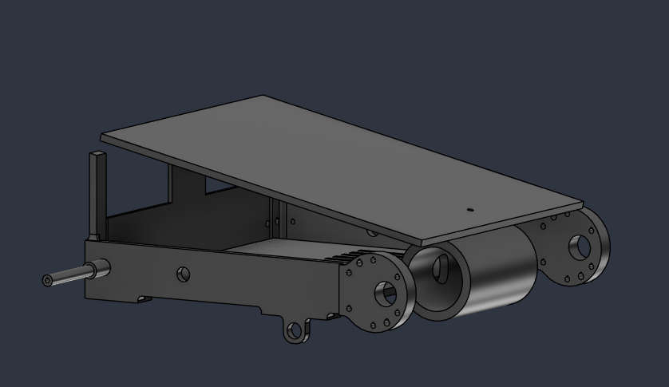
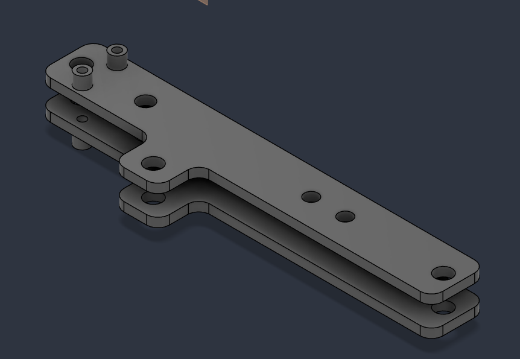
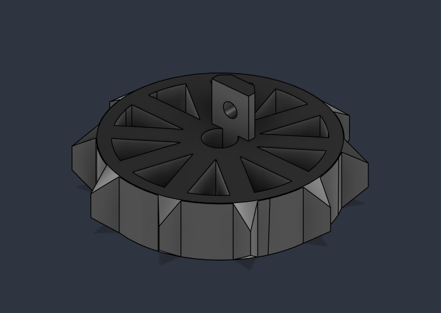
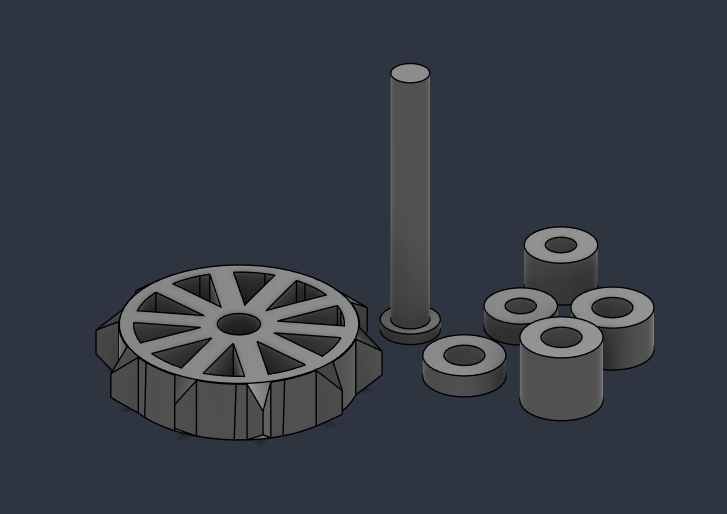
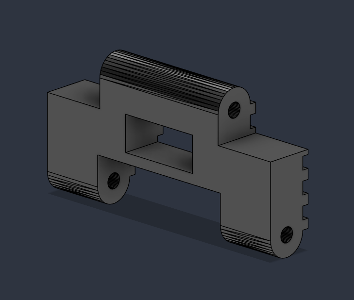

# CAD Files

This folder contains the CAD files used for the design and development of the **CRATER — Compact Rover for Autonomous Tunnel Exploration and Rescue**.

### File Formats

* **`.F3D`** — Fusion 360 design files
* **`.STL`** — 3D-printable CAD models

## CAD Designs

### Chassis

### Frame Brace

### Motor & Hub

### Tread Hub & Links

### Tread Link

